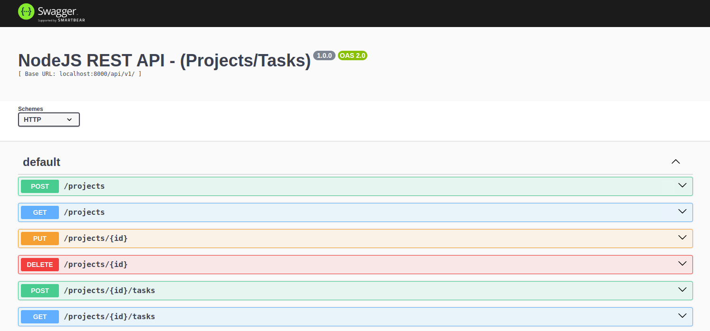

# CRUD para criação e manutenção de Projetos e Tarefas com autenticação JWT.

## Rodando o backend sem Docker

Instale o Node
```
$nvm install 16.10.0
$nvm use 16.10.0
```

## Configurando o banco de dados
O backend usa MongoDB para a gravação de dados, para rodar o mongo no seu ambiente local com Docker use:
```
$docker run -d -h mongo --name mongo -p 27017:27017 mongo:6.0-focal
```
Caso queira usar o MongoDB Compass, use essa string de conexão:
<b>mongodb://localhost:27017</b>


## Executando o backend
Na pasta raiz do projeto digite:
```
$cd backend
$npm install
$npm run start
```
O servidor roda na porta 8000, para verificar se tudo esta ok acesse [http://localhost:8000/api/v1/healthcheck](http://localhost:8000/api/v1/healthcheck)

## Rodando a aplicação completa
Para executar o backend + frontend + banco de dados, instale o docker-compose [veja como instalar aqui](https://docs.docker.com/compose/install/), na pasta raiz do projeto, digite o seguinte comando:
```
$docker-compose up -d
```

## Documentação OpenAPI - Swagger
Esse projeto conta com Swagger para documentação de todos os endpoints com seus respectivos parâmetros, requests e responses.
\
[Clique aqui acessar o Swagger](http://localhost:8000/api/v1/api-docs), 
você verá uma tela conforme abaixo.
